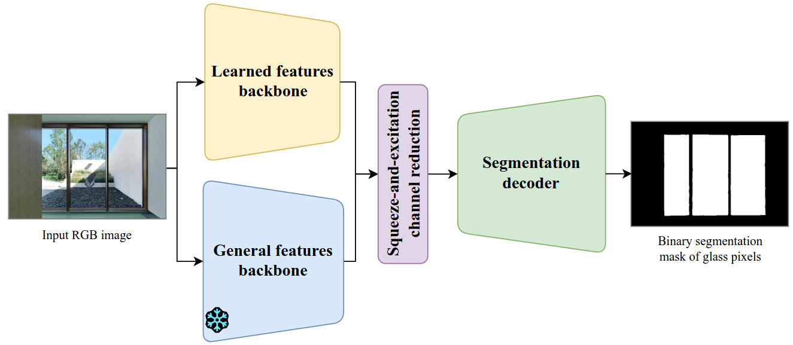
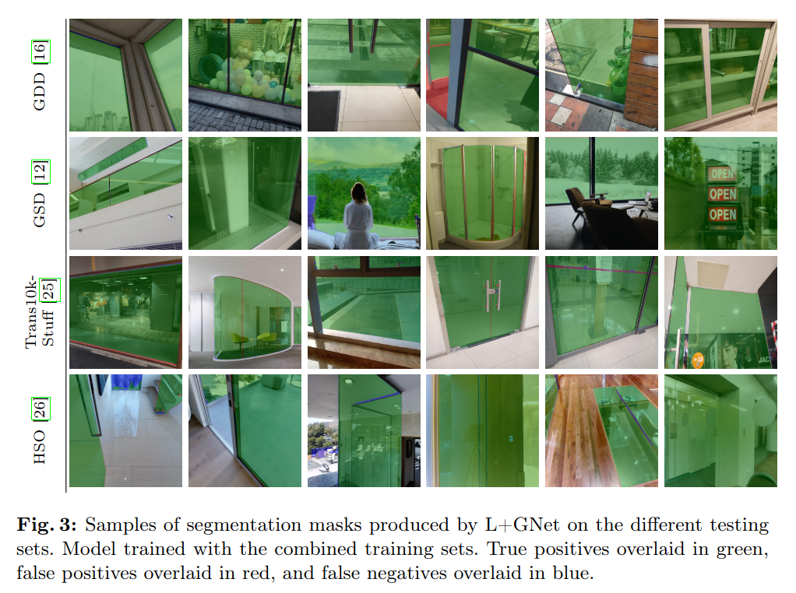

# Glass Segmentation with Fusion of Learned and General Visual Features (L+GNet)
[](https://arxiv.org/abs/2603.03718)

Official implementation of the L+GNet model, proposed in paper Glass Segmentation with Fusion of Learned and General Visual Features.

<p align="center">
    
</p>

<p align="center">
    
</p>

## Installation 
Install dependencies with pip

```bash
pip install -r requirements.txt
```

NOTE: to run the models, you will need Hugging Face setup on your system, as well as access to the DINOv3 model repositories in Hugging Face.

## Training
Training can be performed via

`python dev.py --mode train --dataset-path <path to dataset>`

Dataset folder is expected to contain the following structure

```
dataset
└── train/
    ├── image/
    └── mask/
```

where the folders contain the images and masks with corresponding filenames.

See the argument parser for full list of flags that can be provided.

## Testing
Testing can be performed via:

`python dev.py --mode test --dataset-path <path to dataset> --weights-path <path to stored weights> --metrics`

Dataset folder is expected to contain the following structure

```
dataset
└── test/
    ├── image/
    └── mask/
```

where the folders contain the images and masks with corresponding filenames.

See the argument parser for full list of flags that can be provided.


## Inference demo

A minimal example on how to run inference on a single image has been provided in infer.py.

To run the inference with L+GNet:

`python infer.py --image-path <path to an image> --weights-path <path to stored weights> --output-folder <path to output folder>`

See argument parser for details if you want to specify the DINOv3 backbone size.

## Pretrained weights

Weights for L+GNet trained on different datasets (GDD, GSD, Trans10k-stuff, HSO, all four training sets combined) are available behind the following link: [weights folder](https://drive.google.com/drive/folders/1iO5MQG3m68Sqq4bVOWiu158pIfXLdyDx?usp=sharing)

Prefix in the filename defines the dataset on which the model has been trained on.


## Acknowledgement

Some of the code has been created based on the repo [DINOv3-Mask2former](https://github.com/Carti-97/DINOv3-Mask2former) by GitHub user Carti-97.


